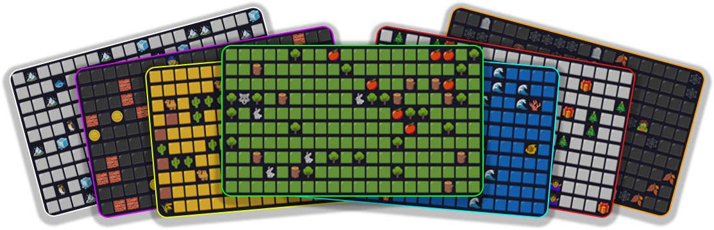

# 🌍 Симуляция Мира

Консольный проект симуляции мира, в котором существа с простым ИИ взаимодействуют в настраиваемой экосистеме. Симуляция является пошаговой и гибко настраивается через внешние файлы конфигурации.

[](https://github.com/zux13/world_simulation/actions/workflows/maven.yml)

## ✨ Особенности

-   **Пошаговая симуляция**: Мир развивается дискретными ходами (шагами).
-   **ИИ существ**: Травоядные и хищники обладают различным поведением (побег, погоня, поиск пищи).
-   **Поиск пути**: Существа используют алгоритм A* для эффективной навигации по миру.
-   **Ключевые механики**: Включает механики зрения, голода, здоровья и передвижения.
-   **Событийно-ориентированная архитектура**: Ключевые взаимодействия обрабатываются через шину событий, что уменьшает связанность компонентов.
-   **Внешняя конфигурация**: Почти все параметры симуляции (плотность сущностей, характеристики и т.д.) управляются через внешний файл `simulation.properties`.
-   **Темы**: Визуальное представление всех сущностей можно настраивать с помощью JSON-файлов тем.


## 🚀 Как запустить

1. Перейдите на страницу [Releases](https://github.com/zux13/world_simulation/releases) и скачайте последний архив вида:
`world_simulation-1.0-release.zip`
2. Распакуйте архив в любую удобную папку.
3. Убедитесь, что у вас установлен Java 21:
```bash
java --version 
```
4. Запустите симуляцию:
```bash
java -jar world_simulation-1.0.jar
```
После запуска появится меню, позволяющее начать симуляцию, изменить настройки или выйти.

## 🏛️ Обзор архитектуры

Проект разработан с упором на модульность и гибкость конфигурации.

-   **Ядро симуляции**: Класс `Simulation` содержит главный цикл, который на каждом шаге обрабатывает последовательность задач (`SimulationTask`). Такой подход четко разделяет различные фазы хода (например, движение, рост травы, респаун существ).
-   **Система сущностей**: Все объекты на карте наследуются от класса `Entity`. `Creature` — это абстрактный класс для живых существ, который далее расширяется классами `Herbivore` и `Predator`.
-   **Игровое поле (`Board`)**: Класс `Board` представляет собой сетку мира и предоставляет методы для доступа и изменения ее состояния, такие как поиск сущностей или пустых координат.
-   **Событийно-ориентированная логика**: `EventBus` используется для уменьшения связанности компонентов. Например, когда существо выполняет действие, оно публикует событие. Другие системы, такие как `HungerManager` или `ActionLogger`, подписываются на эти события для выполнения своей логики.

### 🧠 Принятие решений существами

"Мозгом" существа является его `DecisionMaker`. Логика определяется типом существа:

**Травоядные (`HerbivoreDecisionMaker`):**
1.  **Побег**: Если хищник находится в радиусе `vision` (зрения), травоядное попытается переместиться на соседнюю клетку, наиболее удаленную от хищника.
2.  **Еда**: Если на соседней клетке есть трава, оно ее съест.
3.  **Поиск пищи**: Если в радиусе `vision` видна трава, существо будет использовать алгоритм поиска пути A* (`AStarPathFinder`), чтобы двигаться к ближайшей траве.
4.  **Блуждание**: Если ни одно из вышеперечисленных условий не выполняется, оно будет бродить в полуслучайном направлении.

**Хищники (`PredatorDecisionMaker`):**
1.  **Атака/Поедание**: Если на соседней клетке находится травоядное, хищник его атакует. Если атака смертельна, это считается действием "поедания", которое утоляет голод и лечит существо.
2.  **Погоня**: Если в радиусе `vision` видно травоядное, хищник будет использовать A* для движения к нему.
3.  **Блуждание**: Если добычи не видно, он будет бродить.

### ⚙️ Ключевые механики

-   **Механика движения**: Движение обрабатывается "тиками" в рамках одного хода. `CreatureMovementTask` дает каждому существу количество шагов, равное его `speed`. Задача выполняется в цикле, позволяя каждому существу с оставшимися шагами перемещаться на одну клетку за раз. Это создает иллюзию одновременного движения. Для лучшей визуализации между тиками делается небольшая пауза.
-   **Зрение**: У каждого существа есть атрибут `vision`, который определяет радиус, в пределах которого оно может "видеть" другие сущности. Это используется для обнаружения пищи, добычи или угроз.
-   **Голод**: Каждое существо имеет шкалу голода. Она уменьшается с каждым ходом. Когда голод достигает нуля, существо начинает получать урон, пока не поест или не умрет.

## 🎨 Конфигурация и темы

Все настраиваемые пользователем файлы находятся в каталоге `external-resources/`, который должен находиться в той же директории, что и исполняемый JAR-файл.

### `simulation.properties`

Этот файл содержит все числовые параметры для симуляции, такие как:
-   Размеры поля (`board.size.width`, `board.size.height`).
-   Плотность появления сущностей (`board.density.rock`, `board.density.herbivore` и т.д.).
-   Характеристики существ (здоровье, скорость, зрение, атака).
-   Настройки механик (длительность тика, скорость роста травы).

### Темы

Внешний вид симуляции можно изменить, выбрав тему в меню настроек. Темы определяются `.json` файлами в каталоге `external-resources/themes/`.

**Чтобы добавить новую тему:**
1.  Создайте новый файл, например, `MyTheme.json`, в каталоге `external-resources/themes/`.
2.  Используйте следующую структуру:

    ```json
    {
      "name": "MyTheme",
      "sprites": {
        "default": "  ",
        "herbivore": "H ",
        "predator": "P ",
        "grass": "::",
        "rock": "##",
        "tree": "TT"
      },
      "symbols": {
        "HEALTH": "♥",
        "SPEED": "»",
        "VISION": "•",
        "ATTACK": "x",
        "HUNGER": "h",
        "DEATH": "†",
        "SLEEP": "z",
        "UP": "↑",
        "DOWN": "↓"
      }
    }
    ```
    **Важно**: для корректного выравнивания в консоли все значения в `sprites` должны быть ровно **два символа** в ширину.

3.  Запустите приложение. Ваша новая тема будет доступна в меню "Настройки -> Выбрать тему".